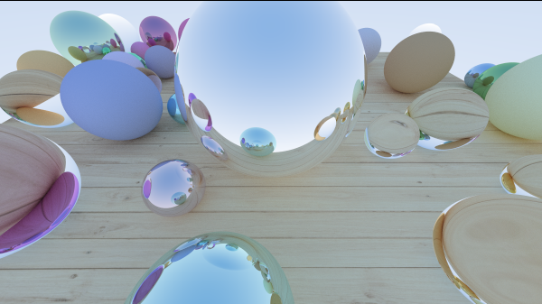

# Raytracing Project
## By Jimmy Zhang (jimmyjz2@illinois.edu)


A Raytracer implemented in Python, following the architecture decribed by "Ray Tracing the next Week" by Peter Shirley

## Features:
- Positionable camera	
- Spheres
- Planes
- Diffuse material	
- Metal material		
- Dielectrics	
- Instancing
- Bounding Volume Hierarchy
- Textures
- Shadows

### Dependencies:
- Python3.8+
- numpy 
- PIL
    
### Running
This project can be run using the following command:
```
    python3 main.py
```

This project will output a "scene.png" in the current working directory

### Files:
    boundingbox.py 
        classes implementing the Bounding Hierarchy Tree
    camera.py
        implements the moveable camera
    main.py
        contains the main driver function, instantiates the world and runs the RayTracer
    materials.py
        classes describing materials and textures
    objects.py
        classes of physical objects within the world and the world itself
    util.py
        helper classes including a Vec3 class, and a Ray class
        The ray class represents a ray through 2 Vec3s, a point and direction

    wood.png
        A wood texture used for the floor plane

    scene_golden.png
        A sample output of the ray RayTracer
        Generated with the following:
            samples_per_pixel = 600
            aspect_ratio = 16.0/9.0
            image_width = 600
            ray_depth = 25
        You can customize the settings by editing the constants marked "PARAMETERS"
        at the start of: RayTracer() in main.py

## Remarks
There are notable changes in order to take advantage Python's power dynamic typing abilities compared to Peter Shirley's book. 
Namely, my BVH implementation relies on reducing a dynamic list of bounding boxes and objects into a tree structure. The raytracer builds the tree in a bottom up manner, combining nodes until the root is reached. This is contrast with the RTIAW (Ray Tracing in a Weekend) which goes in a top down manner.  Next, materials and colors are treated as first class attributes of objects rather than references. 
Finally, I use my Vec3 class to represent any three length array, which includes representing colors, points, and vectors for my raytracer.

I also implemented my own Vec3 api, which is essentially a wrapper for a 3-item Python list.

### Performance
I also support multithreading, assigning a number of rows for each thread. On my Ryzen 5600x, using 6 threads yields about a 2.5x in improvement. For my Vec3 implementation, I opted to use the standard python list rather than a numpy array as the underlying data strucutre. This is because while numpy arrays are very fast a vectorized operations, they have much greater overhead for object construction. Because of the short length Vec3, and because Python lists are heavily optimized for insertion and manipulation, performance is actually greater for numpy.

Profiling the code, the raytracer spends 90%+ of its time traversing the BVH tree and very little time actually simulating the objects. One could probably achieve greater performance by mapping the BVH to Cython, or by using a more efficent algorthim. Given the small size of the tree, I also think caching traversals would be useful as well.

I also thought about vectorization but I could not come up with a performant enough scheme for numpy. The main issue is that a set of rays need the same physics calculation to be vectorized by numpy. But a set of rays, say for sampling of one pixel, may bounce into objects of different types. In general only the first bounce can be guaranteed to be the same for a set of nodes on a pixel. 
This is a limitation of the fact that objects are represented as mathematical formulas. In a real ray tracing engine, the bounces would on be polygons and would be very vectorizeable.

One would have to dynamically group similar ray calculations at runtime to take advantage of vectorization, either by masking the vector or reordering them. While this is possible and a technique often used in HPC, is outside the scope of this project. 

The raytracer takes about 20minutes to render the sample image at 900x600. 

References:
    - https://raytracing.github.io/books/RayTracingInOneWeekend.html
    - https://raytracing.github.io/books/RayTracingTheNextWeek.html
    - https://www.pexels.com/photo/brown-wooden-parquet-flooring-129731/
